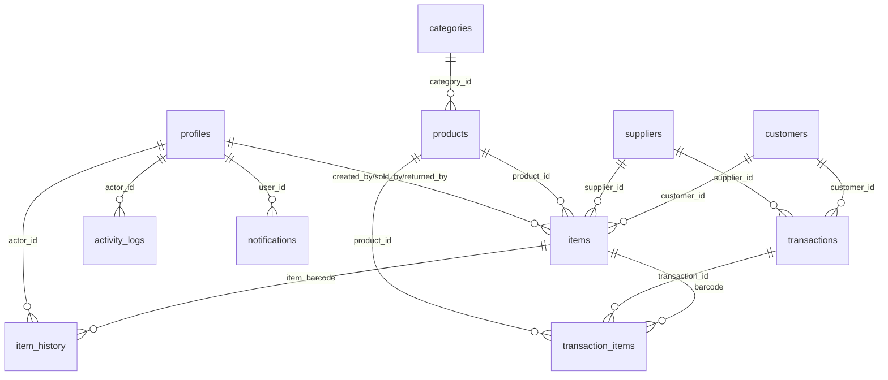

# 📋 تقرير مراجعة شامل لمشروع RT PRO (سمارت ستور)

> **تاريخ المراجعة:** 2026-03-24
> **الإصدار:** Next.js 16.1.6 + Supabase + Zustand
> **نوع المشروع:** نظام إدارة مخازن ومبيعات بنظام السيريال نمبر (Barcode)

---

## 📊 ملخص تنفيذي

| البُعد | التقييم | الملاحظات |
|--------|---------|-----------|
| **البنية المعمارية** | ⚠️ متوسط | فصل جيد للمكونات، لكن كل الخدمات تعمل على Client-Side |
| **قاعدة البيانات** | ⚠️ متوسط | تصميم جيد مع RLS مُفعّل، لكن يوجد عدم تطابق بين الأنواع والواقع |
| **الأمان** | 🔴 ضعيف | عمليات حساسة تتم من Client-Side بدون Server Actions |
| **سلامة البيانات** | 🔴 ضعيف | عمليات مالية بدون DB Transactions ذرية |
| **تجربة المستخدم** | 🟢 جيد | تصميم بصري ممتاز وموجه للموبايل |
| **جودة الكود** | ⚠️ متوسط | تنظيم ملفات جيد مع بعض المشاكل المنطقية |

---

## 🔴 مشاكل حرجة (Critical)

### 1. عمليات الديون غير ذرية (Race Condition)

**الملف:** [debtService.ts](file:///e:/nn/rtpro-main/src/lib/services/debtService.ts#L87-L147)

عملية `processPayment` تنفذ 4 خطوات منفصلة (قراءة الرصيد → تحديث الرصيد → إنشاء معاملة → تسجيل نشاط) بدون استخدام DB Transaction ذرية. إذا فشلت أي خطوة وسطى:
- **السيناريو:** يتم خصم الرصيد لكن لا يتم تسجيل المعاملة = **فقدان بيانات مالية**
- **التأثير:** إذا طلب مستخدمان دفعاً في نفس اللحظة، يمكن أن يقرأ كلاهما نفس الرصيد القديم

> [!CAUTION]
> الكود نفسه يعترف بالمشكلة في السطر 125:
> `// We don't throw here to avoid rollback complexity, but in a real app we'd use a DB transaction/RPC.`

**الحل:** استخدام Supabase RPC مثل ما تم في `supplierService.recordPayment` → `pay_supplier_debt`

---

### 2. كل الخدمات تعمل على Client-Side

**الملفات:** جميع ملفات `src/lib/services/*.ts`

كل الخدمات (10 خدمات) تستخدم `createClient()` من `@/lib/supabase/client` مما يعني:
- جميع عمليات CRUD تتم مباشرة من المتصفح
- الاعتماد الكامل على RLS فقط للحماية
- لا يوجد أي Server Action للعمليات الحساسة (ما عدا `userActions.ts` و `authActions.ts`)

**العمليات التي يجب أن تكون Server Actions:**
- حذف العملاء/الموردين
- إنشاء/تعديل المنتجات
- عمليات الدفع والتحصيل
- تسجيل عمليات البيع

> [!WARNING]
> أي مستخدم لديه `ANON_KEY` يمكنه نظرياً تعديل البيانات مباشرة عبر Supabase API إذا كانت سياسات RLS غير محكمة بالكامل.

---

### 3. عدم تطابق بين أنواع TypeScript وقاعدة البيانات

**الملف:** [database.types.ts](file:///e:/nn/rtpro-main/src/lib/database.types.ts)

| الحقل/الجدول | في TypeScript | في Supabase الفعلي | المشكلة |
|---------------|---------------|-------------------|---------|
| `items.status` | `'In-Stock' \| 'Sold' \| 'Returned'` | يشمل أيضاً `'Exchanging' \| 'Exchanged'` | أنواع ناقصة |
| `products.category` | غير موجود | عمود `category` (text) موجود | عمود إضافي غير مُعرَّف |
| `categories.icon` | غير موجود | عمود `icon` (text) موجود | عمود إضافي غير مُعرَّف |
| `suppliers.address` | موجود في TypeScript | **غير موجود** في DB | عمود وهمي |
| `item_history.target_id` | غير موجود | عمود `target_id` (uuid) موجود | حقل مهم ناقص |
| `activity_logs` | غير موجود | جدول كامل موجود (11 عمود) | **جدول كامل ناقص** |
| `notifications` | غير موجود | جدول كامل موجود (8 أعمدة) | **جدول كامل ناقص** |

> [!IMPORTANT]
> يجب تشغيل `supabase gen types` لإعادة توليد الأنواع تلقائياً أو تحديث `database.types.ts` يدوياً.

---

### 4. `transactionService` يستخدم حقل `target_id` غير موجود في الأنواع

**الملف:** [transactionService.ts](file:///e:/nn/rtpro-main/src/lib/services/transactionService.ts#L48-L62)

```typescript
// السطر 61 - يبحث عن items عبر item_history.target_id
.eq('target_id', id)
```

حقل `target_id` موجود فعلاً في DB لكنه **غير مُعرَّف** في `ItemHistory` type مما يعني أن TypeScript لن يكشف الأخطاء.

---

## ⚠️ مشاكل مهمة (Important)

### 5. إحصائية وهمية ثابتة في الصفحة الرئيسية

**الملف:** [page.tsx](file:///e:/nn/rtpro-main/src/app/page.tsx#L138)

```tsx
<span className="text-xs font-black text-emerald-400">+12% عن أمس</span>
```

هذه النسبة **ثابتة وليست محسوبة** من البيانات الفعلية. المستخدم يرى دائماً `+12%` بغض النظر عن الأداء الحقيقي.

**التأثير:** معلومات مضللة → قرارات خاطئة.

---

### 6. صفحة المالية تطلب RPC غير مضمون + خطأ منطقي

**الملف:** [finance/page.tsx](file:///e:/nn/rtpro-main/src/app/finance/page.tsx#L63-L83)

```typescript
const { data: rpcData, error: rpcError } = await supabase.rpc('get_finance_stats');

if (!rpcError && rpcData) {
  // ... يستخدم البيانات
  console.error("RPC failed, please run docs/database_updates.sql", rpcError);
  // ↑ هذا السطر يطبع خطأ حتى لو نجح RPC! (لأنه داخل if النجاح)
}
```

- `console.error` يُنفَّذ داخل بلوك النجاح = خطأ منطقي
- لا يوجد fallback إذا فشل `get_finance_stats` RPC
- `timeRange` state يتغير لكن لا يُستخدم فعلاً في الاستعلام

---

### 7. غياب Pagination كامل

**جميع الخدمات** تجلب كل البيانات مرة واحدة بدون تصفح:

```typescript
// مثال من productService
.select('*, categories(name)')
.order('created_at', { ascending: false })
// لا يوجد .range() أو .limit()
```

**التأثير:** مع نمو البيانات (مثلاً 10,000+ قطعة في المخزون)، الأداء سيتدهور بشكل كبير.

---

### 8. عدم وجود نظام تدويل (i18n) رغم وجود محاولة سابقة

المشروع يحتوي على نصوص عربية مكتوبة مباشرة في الكود (Hardcoded Arabic):

```typescript
// في usePOSStore.ts
set({ loading: false, error: 'هذه القطعة مضافة بالفعل في السلة' });

// في customerService.ts
throw new Error('لا يمكن حذف العميل - لديه قطع مباعة مرتبطة به');
```

من تاريخ المحادثات السابقة، كانت هناك محاولة لترجمة التطبيق لكنها لم تكتمل. النصوص مشتتة بين العربية والإنجليزية بدون نظام موحد.

---

### 9. Proxy Middleware يستعلم عن Profile في كل Request

**الملف:** [middleware.ts](file:///e:/nn/rtpro-main/src/lib/supabase/middleware.ts#L91-L107)

```typescript
if (user && requiredPermissionKey) {
  const { data: profile } = await supabase
    .from('profiles')
    .select('role, permissions')
    .eq('id', user.id)
    .single()
```

كل طلب HTTP يمر على route محمي يرسل:
1. `supabase.auth.getUser()` → استعلام Auth
2. `supabase.from('profiles').select()` → استعلام إضافي للصلاحيات

**التأثير:** زمن استجابة مضاعف لكل صفحة. يُفضَّل تخزين الصلاحيات في JWT claims أو في cookie مشفر.

---

### 10. حذف المنتج بدون فحص القطع المرتبطة

**الملف:** [productService.ts](file:///e:/nn/rtpro-main/src/lib/services/productService.ts#L58-L67)

```typescript
async delete(id: string) {
  const { error } = await supabase
    .from('products')
    .delete()
    .eq('id', id);
  if (error) throw error;
}
```

لا يوجد فحص إذا كان المنتج له قطع `items` مرتبطة (مثلما يفعل `customerService.delete` و `supplierService.delete`). سيفشل بسبب Foreign Key لكن الخطأ سيكون غير واضح للمستخدم.

---

### 11. `useProducts` يستخدم `confirm()` المتصفح

**الملف:** [useProducts.ts](file:///e:/nn/rtpro-main/src/hooks/useProducts.ts#L61)

```typescript
const deleteProduct = async (id: string) => {
  if (!confirm('هل أنت متأكد من حذف هذا المنتج الأساسي؟')) return;
```

استخدام `window.confirm` غير متوافق مع تصميم التطبيق الفاخر ويخرج عن سياق الـ UI. يجب استبداله بـ Dialog مخصص.

---

## 📐 مشاكل معمارية (Architecture)

### 12. تعريف مكرر للأنواع (Duplicate Types)

| النوع | معرَّف في | معرَّف أيضاً في |
|-------|----------|-----------------|
| `Product` | `database.types.ts` | `productService.ts` (نسخة مختلفة) |
| `Customer` | `database.types.ts` | `customerService.ts` (نسخة مختلفة) |
| `Supplier` | `database.types.ts` | `supplierService.ts` (نسخة مختلفة) |
| `Category` | `database.types.ts` | `categoryService.ts` (نسخة مبسطة مع `description` إضافي) |

**التأثير:** تعديل الـ schema يتطلب تحديث عدة ملفات يدوياً مما يزيد احتمالية عدم التطابق.

---

### 13. عدم وجود Error Boundary

لا يوجد `error.tsx` في أي مستوى من مستويات التطبيق. أي خطأ runtime سيُظهر شاشة بيضاء فارغة بدون أي رسالة للمستخدم.

---

### 14. حقل `address` في Supplier Type لكنه غير موجود في DB

**الملف:** [database.types.ts](file:///e:/nn/rtpro-main/src/lib/database.types.ts#L37-L43)

```typescript
export interface Supplier {
  address: string | null;  // ← غير موجود في قاعدة البيانات!
}
```

أي محاولة لحفظ عنوان المورد ستُرفض من Supabase أو ستُتجاهل بصمت.

---

## 🎨 تجربة المستخدم (UX)

### 15. نقاط القوة ✅

| الميزة | التقييم |
|--------|---------|
| تصميم Dark Mode احترافي | ⭐⭐⭐⭐⭐ |
| تحسين للموبايل (Bottom Nav, Thumb Zone) | ⭐⭐⭐⭐⭐ |
| PWA Support (Service Worker, Manifest) | ⭐⭐⭐⭐ |
| Framer Motion animations | ⭐⭐⭐⭐⭐ |
| POS barcode scanner workflow | ⭐⭐⭐⭐ |
| Park/Restore cart feature | ⭐⭐⭐⭐⭐ |
| Real-time notifications | ⭐⭐⭐⭐ |
| Glassmorphism design | ⭐⭐⭐⭐⭐ |

### 16. نقاط ضعف UX ⚠️

- **لا يوجد Empty State** في بعض الصفحات عند عدم وجود بيانات
- **لا يوجد Skeleton Loading** - فقط Spinner عام
- **BottomNav لا يتحقق من الصلاحيات** — الموظف يرى كل الروابط لكن يُعاد توجيهه عند الضغط
- **لا يوجد تأكيد قبل إفراغ السلة** (`clearCart` في POS)
- **عدم وجود صفحة 404 مخصصة**
- **لا يوجد Pull-to-Refresh** في صفحات القوائم

---

## 🗄️ قاعدة البيانات

### 17. هيكل قاعدة البيانات الفعلي



### 18. ملاحظات على DB

| الملاحظة | التفاصيل |
|----------|---------|
| ✅ RLS مُفعّل | على جميع الجداول الـ 11 |
| ✅ UUIDs | كل الجداول تستخدم UUID كمفتاح أساسي |
| ✅ Foreign Keys | علاقات محكمة بين الجداول |
| ⚠️ `products.category` | عمود text قديم + `category_id` UUID جديد = ازدواجية |
| ⚠️ `supplier_transactions` | موجود في Types لكن **غير موجود** في DB الفعلية |
| ⚠️ لا يوجد Indexes إضافية | الاستعلامات على `items.status` و `transactions.type` بدون index |

---

## 🔒 الأمان

### 19. ملخص الوضع الأمني

| الجانب | الحالة | التفاصيل |
|--------|--------|---------|
| RLS | ✅ مُفعّل | على كل الجداول |
| Auth | ✅ جيد | Supabase Auth مع proxy protection |
| Admin Client | ✅ جيد | `SERVICE_ROLE_KEY` في Server Actions فقط |
| Route Protection | ⚠️ زائد | يستعلم عن الصلاحيات في كل request |
| Client-Side Services | 🔴 خطر | عمليات حساسة من المتصفح مباشرة |
| Input Validation | ⚠️ جزئي | Barcode validation موجود، لكن لا يوجد Zod validation في الخدمات |
| Environment Variables | ✅ جيد | `.env.local` مع فصل بين ANON_KEY و SERVICE_ROLE_KEY |

---

## ✅ نقاط القوة العامة في المشروع

1. **تصميم بصري استثنائي** - Dark mode احترافي مع glassmorphism وanimations
2. **فصل المسؤوليات** - Services, Hooks, Store, Components مفصولة جيداً
3. **POS System متكامل** - Park/Restore, Barcode Scanner, Payment Methods
4. **Activity Logging** - تسجيل كل العمليات الهامة
5. **Real-time Notifications** - عبر Supabase Realtime
6. **Permission System** - نظام صلاحيات دقيق (granular permissions)
7. **PWA Ready** - Service Worker + Manifest
8. **Hydration Safety** - حل مشكلة الـ hydration في POS Store
9. **Supplier Payment Atomic** - `pay_supplier_debt` RPC ذري

---

## 📋 خطة العمل المقترحة (بالأولوية)

### المرحلة 1: إصلاحات حرجة 🔴
- [x] تحويل `debtService.processPayment` إلى Supabase RPC ذري
- [x] تحديث `database.types.ts` ليطابق DB الفعلي
- [ ] نقل العمليات الحساسة إلى Server Actions
- [x] إزالة الإحصائية الوهمية `+12%` أو حسابها فعلياً

### المرحلة 2: تحسينات مهمة ⚠️
- [ ] إضافة Pagination لكل الخدمات
- [x] إضافة Error Boundaries
- [x] توحيد الأنواع (مصدر واحد للحقيقة)
- [ ] تخزين الصلاحيات في JWT claims أو cookie
- [x] إصلاح الخطأ المنطقي في `finance/page.tsx`
- [x] إضافة فحص القطع المرتبطة قبل حذف المنتج
- [ ] إزالة عمود `products.category` القديم

### المرحلة 3: تحسينات UX 🎨
- [x] استبدال `confirm()` بـ Dialog مخصص
- [ ] إضافة Skeleton Loading
- [x] إخفاء روابط BottomNav حسب الصلاحيات
- [ ] إضافة تأكيد قبل إفراغ السلة
- [x] إضافة صفحة 404 مخصصة
- [ ] إضافة Pull-to-Refresh

### المرحلة 4: تحسينات مستقبلية 🚀
- [ ] نظام i18n كامل (عربي/إنجليزي)
- [ ] إضافة DB Indexes للاستعلامات المتكررة
- [ ] إضافة اختبارات (Unit + Integration)
- [ ] إزالة جدول `supplier_transactions` الوهمي من Types
- [ ] إضافة Offline-first capabilities كاملة
- [ ] تقارير PDF قابلة للطباعة

---

> **ملاحظة:** هذا التقرير مبني على مراجعة كاملة للكود المصدري وقاعدة بيانات Supabase الفعلية (مشروع `rtpro` - `trqkkeeozpuyzcxyopid`).
