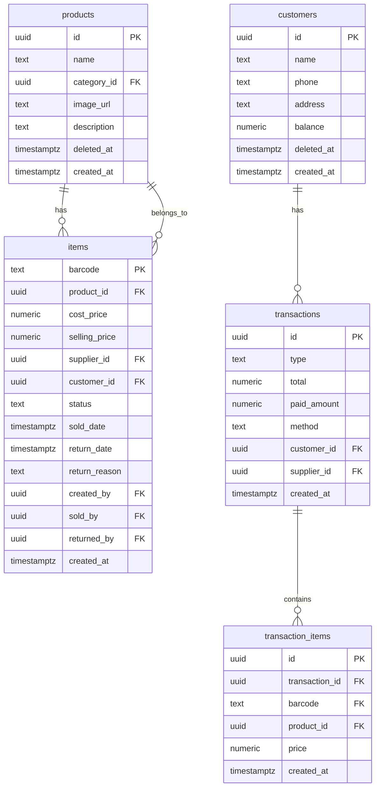
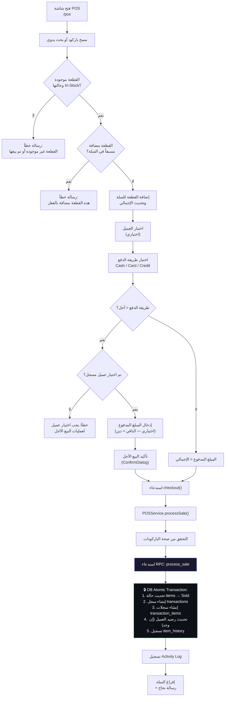
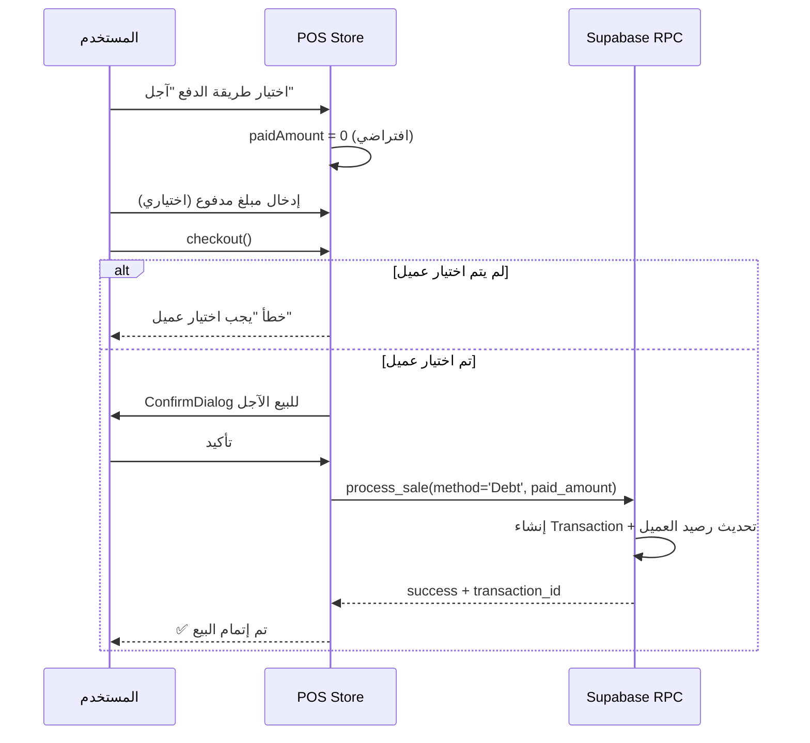
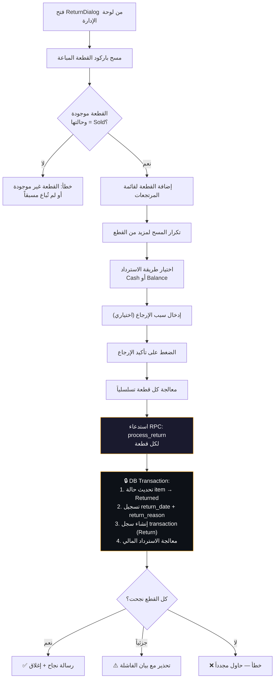
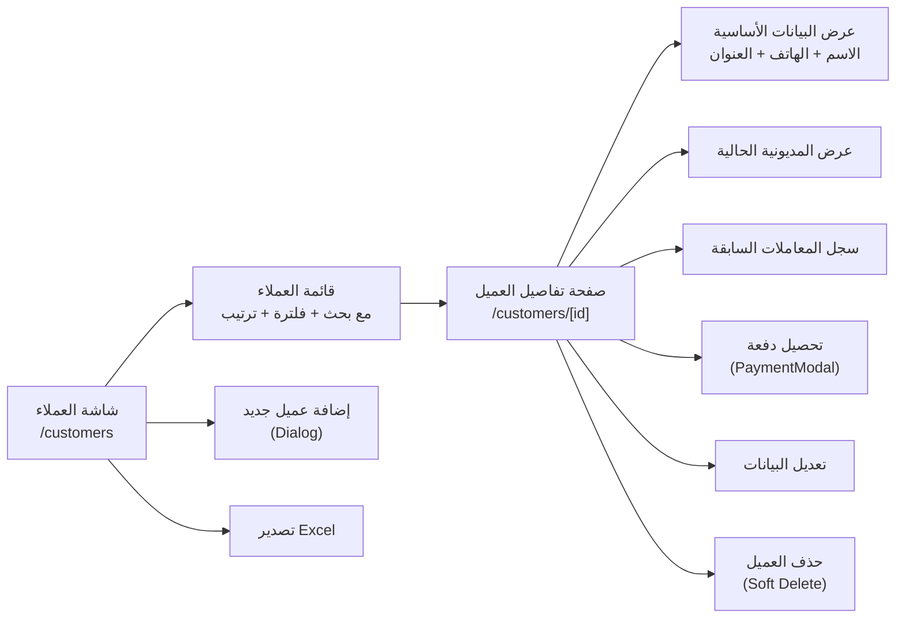
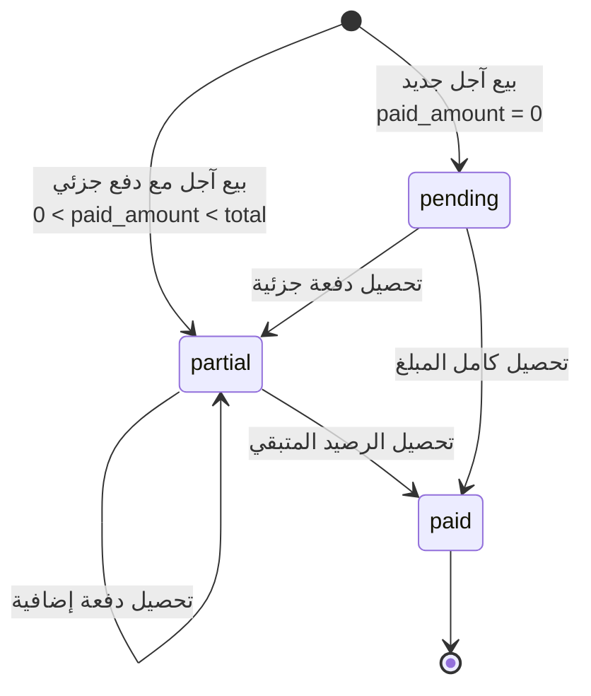
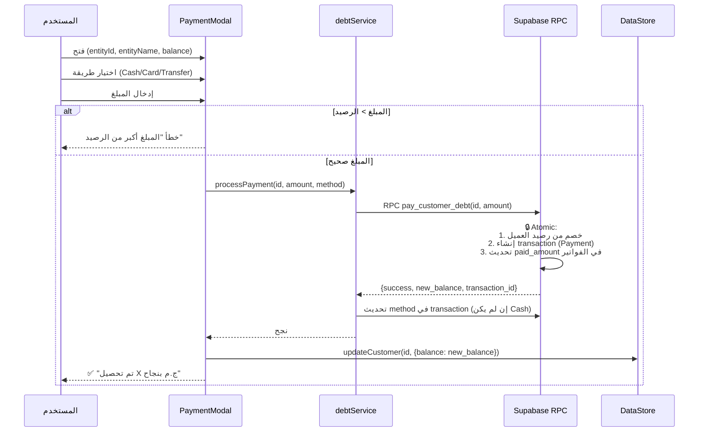
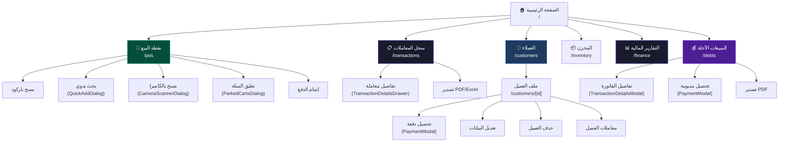

# 📊 تقرير مراجعة شاملة — نظام البيع والمرتجعات والعملاء

> **تاريخ التقرير:** 2026-04-08  
> **المشروع:** RTPro — نظام نقاط البيع وإدارة المخزون  
> **التقنيات:** Next.js 15 (App Router) + Supabase + Zustand + Framer Motion

---

## الفهرس

1. [ملخص تنفيذي](#1-ملخص-تنفيذي)
2. [هيكل البيانات (Data Model)](#2-هيكل-البيانات)
3. [دورة حياة عملية البيع (Sale Lifecycle)](#3-دورة-حياة-عملية-البيع)
4. [نظام المرتجعات (Returns System)](#4-نظام-المرتجعات)
5. [نظام العملاء والمديونيات (Customers & Debts)](#5-نظام-العملاء-والمديونيات)
6. [خريطة الشاشات والتنقل (Screen Map)](#6-خريطة-الشاشات-والتنقل)
7. [تدفق البيانات والمعمارية (Data Flow Architecture)](#7-تدفق-البيانات-والمعمارية)
8. [الملاحظات والمشاكل المكتشفة (Issues & Findings)](#8-الملاحظات-والمشاكل-المكتشفة)
9. [التوصيات (Recommendations)](#9-التوصيات)

---

## 1. ملخص تنفيذي

النظام هو تطبيق POS متكامل يعمل بنظام **Item-Level Tracking** (تتبع على مستوى القطعة/الباركود الفريد)، وليس على مستوى المنتج والكمية. كل قطعة لها باركود فريد (`items.barcode`) ويتم تتبع حالتها عبر دورة حياتها كاملة.

### نقاط القوة:
- ✅ Atomic database operations عبر Supabase RPC (`process_sale`, `process_return`, `pay_customer_debt`)
- ✅ Realtime subscriptions لتحديث البيانات فورياً
- ✅ Optimistic UI updates عبر Zustand global store
- ✅ Parked carts (تعليق الفواتير) مع localStorage persistence
- ✅ دعم البيع الآجل مع تتبع المبلغ المدفوع والمتبقي
- ✅ Soft delete للعملاء مع حماية الحذف إذا كان هناك رصيد

### نقاط الضعف الجوهرية:
- ⚠️ لا يوجد نظام كميات (quantity) — كل item يُمثَّل كصف واحد
- ⚠️ عملية الارجاع غير مربوطة بالعميل
- ⚠️ ReturnDialog غير متصل بأي شاشة واضحة في الـ routing
- ⚠️ لا يوجد تقرير ربط بين المرتجعات والعميل الأصلي

---

## 2. هيكل البيانات

### الجداول الأساسية المتعلقة بالبيع



### حالات القطعة (Item Status)

| الحالة | الوصف |
|--------|-------|
| `In-Stock` | القطعة متاحة في المخزن للبيع |
| `Sold` | تم بيعها — لم تعد متاحة |
| `Returned` | تم إرجاعها — عادت للمخزن |
| `Exchanging` | قيد الاستبدال |
| `Exchanged` | تم استبدالها |

### أنواع المعاملات (Transaction Types)

| النوع | الوصف | تأثير مالي |
|-------|-------|------------|
| `Sale` | عملية بيع | ➕ إيراد |
| `Return` | مرتجع مبيعات | ➖ مصروف/استرداد |
| `Payment` | تحصيل مديونية عميل | ➕ إيراد نقدي |
| `SupplierPayment` | سداد مورد | ➖ مصروف |
| `Expense` | مصروفات تشغيلية | ➖ مصروف |
| `Income` | إيراد آخر | ➕ إيراد |

### طرق الدفع (Payment Methods)

| الطريقة | الوصف |
|---------|-------|
| `Cash` | نقدي |
| `Card` | بطاقة (فيزا) |
| `Debt` | آجل — يُنشئ مديونية على العميل |
| `Transfer` | تحويل بنكي |

---

## 3. دورة حياة عملية البيع

### 3.1 مخطط التدفق الكامل



### 3.2 الملفات المتعلقة بعملية البيع

| الملف | الدور | المسار |
|-------|-------|--------|
| POS Page | شاشة نقطة البيع الرئيسية | [page.tsx](file:///d:/rtpro/src/app/pos/page.tsx) |
| POS Store | إدارة حالة السلة (Zustand + persist) | [usePOSStore.ts](file:///d:/rtpro/src/store/usePOSStore.ts) |
| POS Service | خدمة جلب القطع ومعالجة البيع | [pos-service.ts](file:///d:/rtpro/src/lib/pos-service.ts) |
| POSControlCockpit | لوحة التحكم (باركود + عميل + دفع) | [POSControlCockpit.tsx](file:///d:/rtpro/src/components/pos/POSControlCockpit.tsx) |
| CartItem | عنصر السلة الواحد | [CartItem.tsx](file:///d:/rtpro/src/components/pos/CartItem.tsx) |
| QuickAddDialog | بحث يدوي بالاسم وإضافة سريعة | [QuickAddDialog.tsx](file:///d:/rtpro/src/components/pos/QuickAddDialog.tsx) |
| ParkedCartsDialog | إدارة الفواتير المعلّقة | [ParkedCartsDialog.tsx](file:///d:/rtpro/src/components/pos/ParkedCartsDialog.tsx) |
| Barcode Utils | التحقق من صيغة الباركود | [barcode-utils.ts](file:///d:/rtpro/src/lib/barcode-utils.ts) |

### 3.3 عمليات POS Store التفصيلية

| العملية | الوصف | التحقيقات |
|---------|-------|-----------|
| `addItem(barcode)` | جلب القطعة من DB وإضافتها للسلة | يتأكد أن الحالة `In-Stock` + غير مكررة |
| `removeItem(barcode)` | إزالة قطعة من السلة | يعيد حساب الإجمالي |
| `checkout()` | إتمام عملية البيع | يتحقق من السلة غير فارغة + عميل مطلوب للآجل |
| `parkCart()` | تعليق السلة الحالية | يحفظ في `parkedCarts[]` مع timestamp |
| `restoreCart(id)` | استعادة سلة معلقة | يبادل السلة الحالية مع المعلقة |
| `clearCart()` | إفراغ السلة بالكامل | يطلب تأكيد عبر ConfirmDialog |

### 3.4 البيع الآجل (Credit/Debt Sale)



> [!IMPORTANT]
> عند البيع الآجل، يتم تحويل `paymentMethod` من `'Credit'` إلى `'Debt'` قبل إرساله للـ RPC:
> ```typescript
> paymentMethod === 'Credit' ? 'Debt' : paymentMethod
> ```

---

## 4. نظام المرتجعات

### 4.1 مخطط تدفق الإرجاع



### 4.2 الملفات المتعلقة بالمرتجعات

| الملف | الدور | المسار |
|-------|-------|--------|
| ReturnDialog | شاشة/مودال إرجاع البضاعة | [ReturnDialog.tsx](file:///d:/rtpro/src/components/ReturnDialog.tsx) |

### 4.3 تفاصيل طرق الاسترداد

| الطريقة | الوصف |
|---------|-------|
| `Cash` | استرداد نقدي مباشر |
| `Balance` | إضافة المبلغ كرصيد في حساب العميل |

> [!WARNING]
> **مشكلة مكتشفة:** الـ `ReturnDialog` لا يطلب تحديد العميل عند الإرجاع. القطعة يتم إرجاعها فقط بناءً على حالتها `Sold`، دون ربطها بالعميل الذي اشتراها أصلاً. هذا يعني:
> - لا يمكن التحقق من أن العميل الذي يطلب الإرجاع هو نفسه من اشترى
> - إذا كان الاسترداد بطريقة `Balance`، فلا يوجد عميل محدد لإضافة الرصيد له (يعتمد على الـ RPC)
> - لا يوجد تتبع لمن قام بطلب الإرجاع في واجهة المستخدم

---

## 5. نظام العملاء والمديونيات

### 5.1 مخطط إدارة العملاء



### 5.2 الملفات المتعلقة بالعملاء

| الملف | الدور | المسار |
|-------|-------|--------|
| Customers Page | صفحة قائمة العملاء الرئيسية | [page.tsx](file:///d:/rtpro/src/app/customers/page.tsx) |
| Customer Profile | صفحة تفاصيل العميل الفردي | [page.tsx](file:///d:/rtpro/src/app/customers/%5Bid%5D/page.tsx) |
| Customer List | مكوّن عرض قائمة العملاء | [CustomerList.tsx](file:///d:/rtpro/src/components/management/CustomerList.tsx) |
| Customer Service | خدمة CRUD للعملاء | [customerService.ts](file:///d:/rtpro/src/lib/services/customerService.ts) |
| useCustomers Hook | Hook لإدارة حالة العملاء | [useCustomers.ts](file:///d:/rtpro/src/hooks/useCustomers.ts) |
| Customer Actions | Server Actions للعملاء | [customerActions.ts](file:///d:/rtpro/src/app/actions/customerActions.ts) |

### 5.3 دورة حياة المديونية



### 5.4 تدفق تحصيل المديونية



### 5.5 شاشة المبيعات الآجلة (/debts)

| الملف | الدور | المسار |
|-------|-------|--------|
| Debts Page | صفحة إدارة المبيعات الآجلة | [page.tsx](file:///d:/rtpro/src/app/debts/page.tsx) |
| Debt Service | خدمة جلب وتحصيل المديونيات | [debtService.ts](file:///d:/rtpro/src/lib/services/debtService.ts) |
| useDebts Hook | Hook لإدارة حالة الديون | [useDebts.ts](file:///d:/rtpro/src/hooks/useDebts.ts) |
| DebtCard | بطاقة عرض الدين الواحد | [DebtCard.tsx](file:///d:/rtpro/src/components/debts/DebtCard.tsx) |
| PaymentModal | مودال تحصيل المديونية | [PaymentModal.tsx](file:///d:/rtpro/src/components/debts/PaymentModal.tsx) |
| TransactionDetailsModal | مودال تفاصيل الفاتورة الآجلة | [TransactionDetailsModal.tsx](file:///d:/rtpro/src/components/debts/TransactionDetailsModal.tsx) |

**مميزات شاشة الديون:**
- ملخص إجمالي (إجمالي المديونات + عدد العملاء المدينين + عدد الفواتير الآجلة)
- قائمة الفواتير الآجلة مع حالة كل فاتورة (مسددة / جزئي / معلقة)
- بحث بالاسم أو رقم الفاتورة
- تحميل المزيد (Infinite scroll / pagination)
- تصدير PDF
- تحصيل مباشر من البطاقة

---

## 6. خريطة الشاشات والتنقل



### جدول الشاشات التفصيلي

| الشاشة | المسار | الصلاحية | المحتوى الرئيسي |
|--------|--------|----------|-----------------|
| الرئيسية | `/` | — | إحصائيات + إجراءات سريعة |
| نقطة البيع | `/pos` | `pos` | سلة + باركود + دفع + عميل |
| سجل المعاملات | `/transactions` | `transactions` | كل المعاملات + بحث + تفاصيل |
| العملاء | `/customers` | `customers` | قائمة + إضافة + فلترة + تصدير |
| ملف العميل | `/customers/[id]` | `customers` | بيانات + معاملات + تحصيل + تعديل |
| المبيعات الآجلة | `/debts` | `finance` | ملخص + فواتير آجلة + تحصيل |
| التقارير المالية | `/finance` | `finance` | إيرادات + أرباح + مخزون + ديون + رسم بياني |
| المخزن | `/inventory` | `inventory` | قطع المخزن + إضافة + تفاصيل |

---

## 7. تدفق البيانات والمعمارية

### 7.1 طبقات التطبيق

```
┌─────────────────────────────────────────────────────────┐
│                     📱 الشاشات (Pages)                   │
│  /pos  |  /transactions  |  /customers  |  /debts       │
├─────────────────────────────────────────────────────────┤
│                  🧩 المكونات (Components)                 │
│  POSControlCockpit | CartItem | ReturnDialog | etc.     │
├─────────────────────────────────────────────────────────┤
│                   🪝 الـ Hooks                           │
│  useCustomers | useTransactions | useDebts | usePOS     │
├─────────────────────────────────────────────────────────┤
│                 📦 إدارة الحالة (State)                   │
│  usePOSStore (Zustand+persist) | useDataStore | uiStore │
├─────────────────────────────────────────────────────────┤
│                  🔧 طبقة الخدمات (Services)              │
│  POSService | customerService | debtService | etc.      │
├─────────────────────────────────────────────────────────┤
│                  ⚡ Server Actions                       │
│  customerActions | productActions | authActions          │
├─────────────────────────────────────────────────────────┤
│                 🗄️ Supabase (Database + RPC)             │
│  process_sale | process_return | pay_customer_debt      │
│  get_debt_summary | get_finance_stats                   │
└─────────────────────────────────────────────────────────┘
```

### 7.2 الـ RPCs المستخدمة

| RPC | المعاملات | الوظيفة |
|-----|-----------|---------|
| `process_sale` | `p_items_list`, `p_total_amount`, `p_payment_method`, `p_customer_id`, `p_paid_amount` | معالجة عملية بيع كاملة atomically |
| `process_return` | `p_barcode`, `p_reason`, `p_refund_method` | معالجة إرجاع قطعة واحدة |
| `pay_customer_debt` | `p_customer_id`, `p_amount` | تحصيل مديونية من عميل |
| `get_debt_summary` | — | إحصائيات المديونيات والفواتير الآجلة |
| `get_finance_stats` | `p_since?` | إحصائيات مالية شاملة |
| `get_inventory_stats` | — | إحصائيات المخزون |

### 7.3 Realtime Subscriptions

| الجدول المراقب | الشاشات المستفيدة | الحدث |
|---------------|-------------------|-------|
| `transactions` | Dashboard, Transactions, Finance | `*` (جميع التغييرات) |
| `customers` | Customers Page | `*` |

---

## 8. الملاحظات والمشاكل المكتشفة

### 🔴 مشاكل حرجة (Critical)

| # | المشكلة | التفاصيل | الملف |
|---|---------|----------|-------|
| ✅ C1 | **المرتجع غير مربوط بالعميل** | `ReturnDialog` لا يطلب تحديد العميل. لا يتم التحقق من أن الشخص الذي يطلب الإرجاع هو من اشترى القطعة. إذا كان `refundMethod = 'Balance'` فلا يمكن معرفة أي عميل يُضاف له الرصيد إلا عبر الـ RPC الذي ربما يستخدم `customer_id` المحفوظ في الـ item. | [ReturnDialog.tsx](file:///d:/rtpro/src/components/ReturnDialog.tsx) |
| ✅ C2 | **ReturnDialog غير مدمج في الـ routing** | الـ `ReturnDialog` هو component مستقل ولكنه غير ظاهر في أي صفحة route واضحة. يبدو أنه يُستدعى من مكان ما في الإدارة لكن لا يوجد له route مخصص ولا طريق واضح للوصول إليه. | [ReturnDialog.tsx](file:///d:/rtpro/src/components/ReturnDialog.tsx) |
| C3 | **لا يوجد Quantity tracking** | كل item هو صف مستقل بباركود فريد. لا يمكن بيع "3 قطع من نفس المنتج" — بل يجب مسح 3 باركودات مختلفة. هذا تصميم مقصود لكنه قد يكون محدوداً لبعض أنواع البضائع. | التصميم العام |

### 🟡 مشاكل متوسطة (Medium)

| # | المشكلة | التفاصيل | الملف |
|---|---------|----------|-------|
| ✅ M1 | **عدم وجود نظام خصومات** | لا يوجد آلية لتطبيق خصم على الفاتورة أو على منتج معين | POS System |
| ✅ M2 | **لا يوجد رقم فاتورة متسلسل** | يتم استخدام UUID كمعرف للمعاملة مما يجعل التتبع البشري صعباً. يُعرض فقط أول 8 حروف من الـ UUID. | [TransactionDetailsDrawer.tsx](file:///d:/rtpro/src/components/management/TransactionDetailsDrawer.tsx) |
| ✅ M3 | **الاسترداد يعالج القطع تسلسلياً** | في `handleReturnAll`، كل قطعة تُعالج بـ RPC منفصل بشكل `sequential`، مما قد يكون بطيئاً. الأفضل إنشاء RPC يقبل قائمة باركودات. | [ReturnDialog.tsx:66](file:///d:/rtpro/src/components/ReturnDialog.tsx#L66) |
| ✅ M4 | **PaymentModal لا يدعم الدفع الجزئي للفاتورة الواحدة** | `processPayment` يخصم من الرصيد الكلي للعميل وليس من فاتورة محددة. لا يمكن ربط الدفعة بفاتورة آجلة بعينها. | [PaymentModal.tsx](file:///d:/rtpro/src/components/debts/PaymentModal.tsx) |
| ✅ M5 | **`type: any` casting كثير** | في عدة أماكن يتم استخدام `(t as any).customers?.name` بدلاً من TypeScript generics مناسبة | ملفات متعددة |
| M6 | **عدم وجود حد أقصى لتعليق السلال** | يمكن تعليق عدد غير محدود من السلال، وكلها تُخزن في localStorage | [usePOSStore.ts](file:///d:/rtpro/src/store/usePOSStore.ts) |

### 🟢 ملاحظات تحسينية (Low)

| # | الملاحظة | التفاصيل |
|---|---------|----------|
| ✅ L1 | **playSuccessSound مستورد ولا يُستخدم** | `import { playSuccessSound }` في POS page لكنه غير مُستدعى عند نجاح البيع | 
| ✅ L2 | **CartItem يعرض "في المخزن" دائماً** | Badge "في المخزن" يظهر لكل عنصر في السلة وهو redundant لأن كل شيء في السلة بالتعريف كان In-Stock |
| L3 | **لا توجد طباعة فعلية** | زر "طباعة الإيصال" يستدعي `window.print()` وهو غير محسّن للإيصالات الحرارية |
| L4 | **حذف العميل ConfirmDialog رسالة مضللة** | الرسالة تقول "سيتم حذف أو فقدان ارتباطات" لكن الحذف هو Soft Delete ولا تُفقد البيانات |
| ✅ L5 | **غياب validation للهاتف/العنوان في إضافة العميل** | يمكن إدخال أي نص كرقم هاتف بدون تحقق من الصيغة |

---

## 9. التوصيات

### 🔴 أولوية عالية

1. ✅ **ربط المرتجع بالعميل**: تعديل `ReturnDialog` ليطلب تحديد العميل (أو جلبه تلقائياً من القطعة المباعة) + تمرير `customer_id` للـ RPC
2. ✅ **دمج ReturnDialog في route واضح**: إضافته كزر أو tab في `/pos` أو إنشاء `/returns` route مخصص
3. ✅ **استبدال UUID بـ رقم فاتورة متسلسل**: إضافة عمود `invoice_number SERIAL` في جدول `transactions`

### 🟡 أولوية متوسطة

4. ✅ **إنشاء RPC batch return**: بدلاً من معالجة كل قطعة منفردة، إنشاء `process_batch_return(p_barcodes[], p_reason, p_refund_method, p_customer_id)`
5. ✅ **نظام خصومات**: إضافة `discount_amount` و `discount_percentage` في جدول `transactions`
6. ✅ **ربط الدفعة بالفاتورة**: تعديل `pay_customer_debt` ليقبل `transaction_id` اختياري لربط السداد بفاتورة محددة
7. ✅ **إزالة `type: any` casting**: تحسين TypeScript types في جميع الملفات

### 🟢 أولوية منخفضة

8. ✅ **تفعيل `playSuccessSound`** بعد نجاح البيع
9. ✅ **إزالة badge "في المخزن"** من CartItem أو تغييره لعرض معلومة مفيدة
10. **تحسين نظام الطباعة** لدعم الطابعات الحرارية (ESC/POS أو PDF receipt)
11. ✅ **إضافة validation لرقم الهاتف** قبل حفظ العميل
12. **تحديد حد أقصى للسلال المعلقة** (مثلاً 10 سلال كحد أقصى)
13. **تصحيح رسالة حذف العميل** لتوضح أنه Soft Delete

---

> **ملاحظة:** هذا التقرير يغطي الكود المصدري (Frontend + Service Layer) فقط. منطق الـ RPCs على مستوى قاعدة البيانات (`process_sale`, `process_return`, `pay_customer_debt`) لم يتم مراجعته لأنه مُعرّف في Supabase وليس في الكود المصدري. يُنصح بمراجعة هذه الدوال بشكل منفصل.
